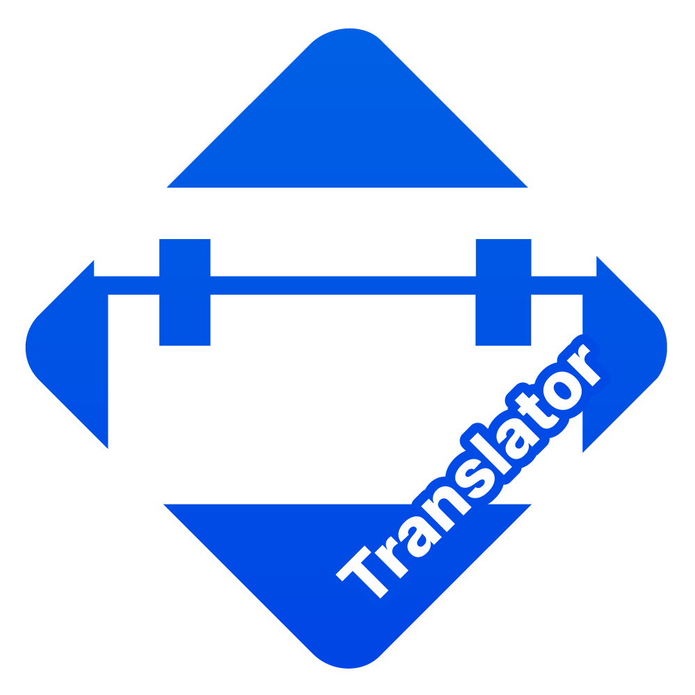

WorldGuard-Translator
=

The easiest, fastest, and best way to translate and customize messages for the <b><a href="https://modrinth.com/plugin/worldguard">WorldGuard</a></b> plugin.

---

## Adding Your Own Translation
You can submit your own translation, and if approved, we will add it to the plugin!

**Please follow these guidelines:**
- Comments for configuration sections must be fully translated.
- The message style must match the design and theme of WorldGuard-Translator.

**Allowed:**
- Giving yourself credit (author attribution) at the top of the configuration file.

**You can contact the developer in several ways:**
- Submit a Pull Request with the translation file attached (the file must be located in the `..root../translations/` folder).
- Join our [Discord server](https://dsc.gg/amazingplugins) and submit your translation in the translation forum channel.

## Code Modification
**Please follow these requirements:**
- Target Java Version: 16
- Test your code thoroughly; broken or non-functional code will not be accepted.

**Instructions**
1. **Fork the repository**
2. **Test your code locally:** Make sure to run the plugin on a test server. Non-functional code will not be accepted.
3. **Create a Pull Request:** Describe in detail what changes you made and what problem they solve.